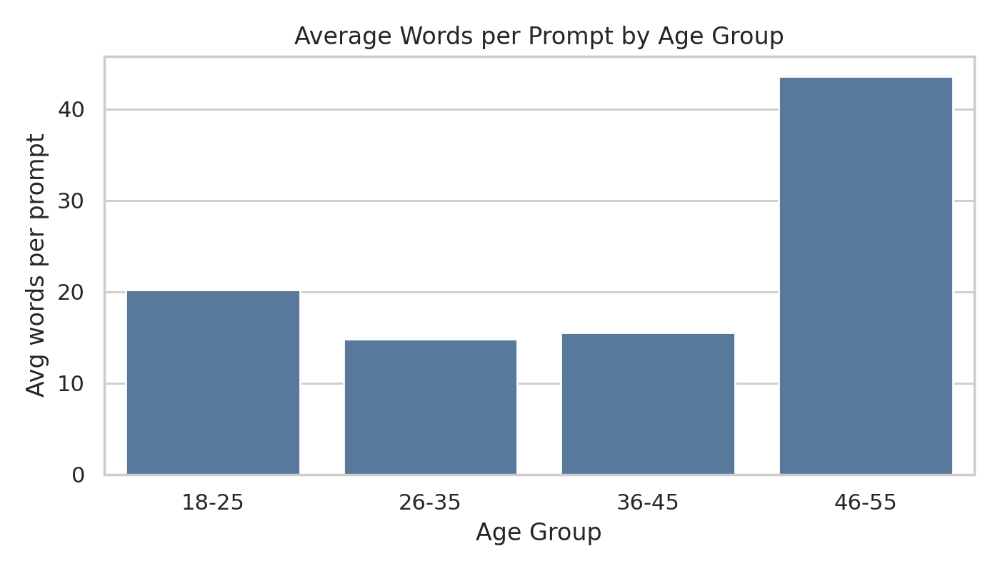
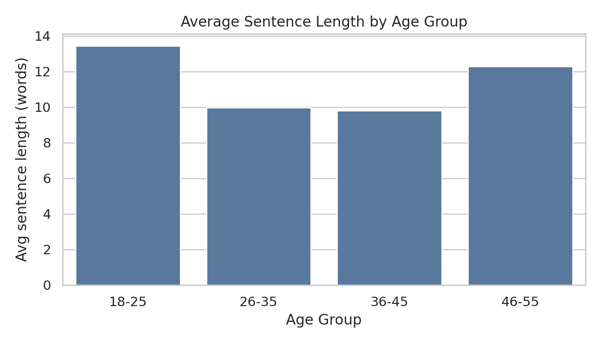
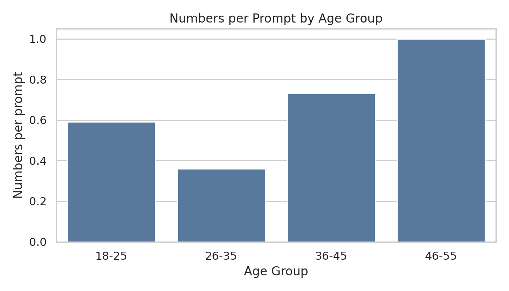

# Data Visualizations
## Indian ChatGPT Usage Study - Comprehensive Visual Analysis

[](./README.md)

**Data Source**: (count to be updated) Indian users, (count to be updated) authentic ChatGPT prompts  
**Collection Period**: August 2025  
**Geographic Coverage**: 9+ Indian cities  

---

## I. Factual Data & Visualizations

### 1. Usage Theme Distribution


**Raw Data**:
- Daily utility and Q&A: 22+ instances
- Writing assistance and rephrasing: 12+ instances  
- Technical help and coding/bugs: 8 instances
- Professional and career (CV/job): 8 instances
- Usage guidance and prompt quality: 6 instances
- Other: 6 instances
- Music/creative tasks: 3 instances

### 2. Age-Based Communication Metrics

#### 2.1 Prompt Length Analysis

**By Characters**:


**By Words (Total Prompt)**:


**By Words (Per Prompt Average)**:


**Raw Data**:
- 18-25: 900 characters, 165 total words, 20 words per prompt
- 26-35: 1,200 characters, 210 total words, 15 words per prompt  
- 36-45: 700 characters, 105 total words, 16 words per prompt
- 46-55: 3,000 characters, 470 total words, 44 words per prompt

#### 2.2 Sentence Structure Analysis



**Raw Data**:
- 18-25: 13.5 words per sentence
- 26-35: 10.0 words per sentence
- 36-45: 10.0 words per sentence  
- 46-55: 12.5 words per sentence

#### 2.3 Numerical Content Usage



**Raw Data**:
- 18-25: 0.6 numbers per prompt
- 26-35: 0.37 numbers per prompt
- 36-45: 0.73 numbers per prompt
- 46-55: 1.0 numbers per prompt

#### 2.4 External Reference Patterns


**Raw Data**:
- 18-25: 0% contain URLs
- 26-35: 0.4% contain URLs  
- 36-45: 5.0% contain URLs
- 46-55: 5.0% contain URLs

### 3. Usage Frequency Correlation


**Raw Data**:
- Daily users: 200 words per prompt
- Weekly users: 175 words per prompt
- Monthly users: 100 words per prompt

### 4. Primary Use Case Analysis


**Raw Data**:
- "All of the above": 375 words per prompt
- Multi-domain usage: 240-275 words per prompt
- Personal assistance: 195 words per prompt  
- Learning & research: 125 words per prompt
- Technical help/coding: 120 words per prompt
- Limited/specific usage: 50-90 words per prompt

### 5. Linguistic Patterns by Age Group

**Documented Observations**:
- **46-55**: Highest punctuation usage, most numbers per prompt, structured formatting
- **36-45**: Highest lexical variety (type-token ratio), maximum URL usage
- **26-35**: Highest second-person pronoun usage
- **18-25**: Highest imperative usage rate, longest individual sentences
- **Code-like markers**: Present across all groups, highest in 36-45 and 46-55
- **Hedging language**: Highest in 26-45 age range, near-zero in 46-55

### 6. Topic Themes by Age Group

**18-25 Topics**: Technology, data analysis, programming-adjacent queries
**26-35 Topics**: Mixed practical queries (finance/EBITDA), content creation, varied personal and professional interests  
**36-45 Topics**: India/AI/business strategy, industry-specific topics (wastewater/environmental)
**46-55 Topics**: Planning, structured writing, LinkedIn optimization, checklist creation

---

## II. Statistical Summary

### Sample Demographics
- **Total Users**: 26 verified participants
- **Total Prompts**: 122 unique submissions
- **Age Distribution**: 18-25 (15%), 26-35 (58%), 36-45 (19%), 46-55 (8%)
- **Usage Frequency**: Daily (85%), Weekly (15%)
- **Geographic Coverage**: 9+ Indian cities

### Key Quantitative Findings
- **Prompt Length Range**: 20-470 words per prompt across age groups
- **Theme Dominance**: Daily utility represents 18% of all usage instances
- **Age-Length Correlation**: 46-55 group writes 23x longer prompts than 18-25 group
- **Frequency-Sophistication**: Daily users write 2x longer prompts than monthly users
- **Use Case Spectrum**: Multi-domain users write 7.5x longer prompts than limited users

---

## III. Research Methodology

### Data Collection
- **Method**: Anonymous Google Forms submission
- **Network**: LinkedIn and WhatsApp professional networks (25,000+ connections)
- **Verification**: Manual analysis of individual prompts
- **Anonymization**: Complete user anonymity maintained

### Analysis Framework
- **Thematic Categorization**: Qualitative research principles
- **Quantitative Metrics**: Character count, word count, sentence analysis
- **Cross-Variable Analysis**: Age, frequency, use case, linguistic patterns
- **Statistical Approach**: Descriptive statistics with small sample considerations

### Data Limitations
- **Sample Size**: 26 users (qualitative depth over quantitative scale)
- **Network Bias**: Professional urban population
- **Geographic Scope**: Major Indian cities only
- **Language Bias**: English-educated users
- **Temporal Scope**: August 2025 data collection window

---

## IV. Interpretations & Research Inferences

### The "Reverse Digital Divide" Phenomenon

**Core Finding**: Older Indian professionals (46-55) demonstrate significantly higher AI interaction sophistication than younger users, contrary to traditional technology adoption patterns.

**Supporting Evidence**:
- 46-55 group: 470 words per prompt vs. 105-210 words for other groups
- Highest numerical content integration (1.0 numbers per prompt)
- Maximum external reference usage (5% URL inclusion)
- Most structured communication patterns

### Professional Maturity & AI Integration Model

**Progression Pattern Observed**:
1. **Technical Acquisition Phase (18-25)**: Skill-focused, efficient queries
2. **Career Diversification Phase (26-35)**: Mixed interests, moderate sophistication
3. **Domain Expertise Phase (36-45)**: Specialized knowledge integration  
4. **Strategic Management Phase (46-55)**: Comprehensive, consultative approach

### Cultural Integration Patterns

**"Comprehensive AI Partner" Behavior**: Indians treat ChatGPT as holistic assistant rather than specialized tool, evidenced by 85% daily usage and multi-domain query patterns.

**Trust-Based Relationship Development**: Daily users demonstrate 2x higher communication investment, suggesting advisory rather than transactional AI relationships.

### Market Implications

**For AI Development**:
- Context window optimization crucial for Indian market (46-55 group requires 3,000+ character capacity)
- Multi-domain functionality more valuable than specialized tools
- Structured input/output formatting essential for professional users

**For Business Strategy**:
- 46-55 demographic represents highest-value AI user segment
- Daily usage frequency correlates with sophistication and likely value extraction
- Professional integration drives longest, most complex interactions

---

## V. Future Research Directions

### Immediate Extensions
- **Rural Population Study**: Non-English speaking user patterns
- **Industry-Specific Analysis**: Sectoral usage deep dives
- **Longitudinal Tracking**: Usage evolution over time
- **Comparative Cultural Analysis**: Other multilingual markets

### Advanced Analysis
- **Prompt Quality Scoring System**: Quantitative sophistication metrics  
- **Cultural Integration Index**: Hinglish and cultural element measurement
- **Cross-Platform Behavioral Comparison**: ChatGPT vs. Claude vs. Gemini patterns
- **Professional ROI Analysis**: Productivity impact measurement

---

## VI. Citation & Usage

### Academic Citation
```bibtex
@misc{indian_chatgpt_visualizations_2025,
  title={Data Visualizations: Indian ChatGPT Usage Study},
  author={Khona, Kalyani},
  year={2025},
  month={August},
  note={GitHub repository: https://github.com/KK92-ai/indian-chatgpt-usage-study/blob/main/data-visualizations.md}
}
```

### Researcher Information
**Kalyani Khona** - Indian entrepreneur, researcher, and co-founder of Inclov  
**Contact**: [LinkedIn](https://www.linkedin.com/in/kalyanikhona/) | [Email](mailto:santimstudio@gmail.com)  
**Publication**: [The Third Frontier](https://thirdfrontier.substack.com/)

---

**📊 [View Raw Data](./data/)** | **📋 [Methodology](./methodology/)** | **🔍 [Analysis Notes](./notes/)** | **⬅️ [Back to Main Study](./README.md)**
